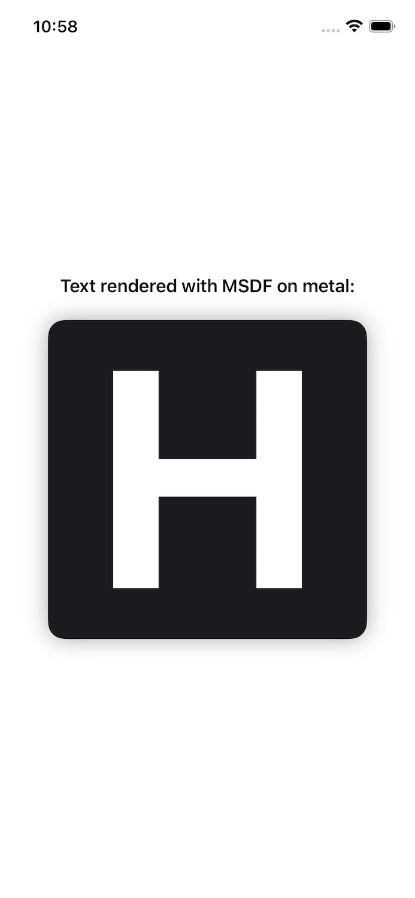

# SwiftSDF

**A Swift package for high-quality Signed Distance Field (SDF) and Multi-channel Signed Distance Field (MSDF/MTSDF) generation from `CGPath` on Apple platforms.**

Built on top of [msdfgen](https://github.com/Chlumsky/msdfgen) and [Skia PathOps](https://skia.org/docs/dev/present/pathops/), SwiftSDF provides a clean, idiomatic Swift API that takes any `CGPath` and produces a packed, Metal-ready texture buffer.

---

## Platform Support


---

## Demo



---

## Table of Contents

- [Overview](#overview)
- [Features](#features)
- [Architecture](#architecture)
- [Requirements](#requirements)
- [Installation](#installation)
- [Quick Start](#quick-start)
- [API Reference](#api-reference)
  - [SDFConfiguration](#sdfconfiguration)
  - [SDFResult](#sdfresult)
  - [SDFGenerator](#sdfgenerator)
  - [Metal Integration](#metal-integration)
- [SDF vs MSDF](#sdf-vs-msdf)
- [Path Simplification with Skia PathOps](#path-simplification-with-skia-pathops)
- [Metal Rendering (Demo)](#metal-rendering-demo)
- [Performance](#performance)
- [Licensing](#licensing)
- [Acknowledgements](#acknowledgements)

---

## Overview

SwiftSDF bridges the gap between Apple's `CoreGraphics`/`CoreText` path world and GPU-accelerated, resolution-independent rendering via Metal. The library takes a `CGPath` — regardless of where it came from (a font glyph, a vector shape, a `UIBezierPath`, a drawn path) — and produces a compact texture buffer encoding a signed distance field.

This buffer can be directly uploaded to a `MTLTexture` and rendered with a tiny Metal fragment shader, giving you:

- **Infinite scalability** — render at any size from a single small texture
- **Sharp edges at all scales** — MSDF mode preserves sharp corners
- **Cheap stroke and drop shadow** — controlled by a single shader threshold

The library focuses entirely on **generation**. It has no Metal dependency, no rendering pipeline, and no UIKit coupling. It simply takes a path and returns data.

---

## Features

- ✅ **SDF and MSDF (MTSDF) generation** from any `CGPath`
- ✅ **Auto mode** — automatically selects SDF or MSDF based on path complexity
- ✅ **Two precision modes** — `unorm8` (1 byte/channel) and `float16` (2 bytes/channel)
- ✅ **Skia PathOps integration** — optional path simplification to resolve self-intersections and overlapping contours before generation
- ✅ **Configurable padding and pixel range** — fine-grained control over the SDF margin
- ✅ **Y-axis flip control** — matches Metal's top-left texture origin out of the box
- ✅ **Clean three-layer Swift Package** — C++ core, ObjC++ bridge, public Swift API
- ✅ **Stroke and shadow for free** — pure shader-side, zero extra generation cost

---

## Architecture

SwiftSDF is structured as three SPM targets that form a strict dependency chain, keeping the C++ internals completely hidden from Swift consumers.

```
┌─────────────────────────────────────────────────────┐
│                    Your App / Renderer              │
└──────────────────────────┬──────────────────────────┘
                           │  import SwiftSDF
┌──────────────────────────▼──────────────────────────┐
│                 SwiftSDF  (Swift)                   │
│  Public API extensions, Metal pixel format helpers  │
│         @_exported import SDFFoundation             │
└──────────────────────────┬──────────────────────────┘
                           │
┌──────────────────────────▼──────────────────────────┐
│             SDFFoundation  (Objective-C++)          │
│   SDFGenerator · SDFResult · SDFConfiguration       │
│   Validation · Precision packing · Error mapping    │
└──────────────────────────┬──────────────────────────┘
                           │
┌──────────────────────────▼──────────────────────────┐
│                 SDFCore  (C++17)                    │
│      msdfgen  ·  Skia PathOps  ·  Generation core   │
└─────────────────────────────────────────────────────┘
```

Clients only ever `import SwiftSDF`. The lower two layers are private implementation details and are never exposed.

---

## Requirements

| Platform  | Minimum Version |
|-----------|----------------|
| iOS       | 12.0           |
| macOS     | 11.0           |
| tvOS      | 12.0           |
| watchOS   | 4.0            |
| visionOS  | 1.0            |
| Swift     | 5.9            |

---

## Installation

### Swift Package Manager

Add SwiftSDF to your `Package.swift` dependencies:

```swift
dependencies: [
    .package(url: "https://github.com/ZeroOneZeroR/SwiftSDF.git", from: "1.0.0")
],
targets: [
    .target(
        name: "YourTarget",
        dependencies: ["SwiftSDF"]
    )
]
```

Or add it directly in Xcode via **File → Add Package Dependencies** and paste the repository URL.

---

## Quick Start

The entire API surface is one call. Give it a path, a mode, and a configuration:

```swift
import SwiftSDF
import CoreText
import Metal

// 1. Get a CGPath from anywhere — CoreText, UIBezierPath, your vector data, etc.
let font = UIFont.systemFont(ofSize: 64)
let path = GlyphUtils.createPath(for: "A", font: font)!

// 2. Configure generation
let config = SDFConfiguration(
    outputWidth:  128,
    outputHeight: 128,
    padding:      8.0,
    range:        8.0,
    precision:    .float16,
    flipY:        true       // flip for Metal's top-left origin
)

// 3. Generate
let result = try SDFGenerator.generate(from: path, requestMode: .msdf, config: config)

// 4. Upload to Metal
let pixelFormat = config.metalPixelFormat(channelFormat: result.channelFormat)
let descriptor  = MTLTextureDescriptor.texture2DDescriptor(
    pixelFormat: pixelFormat, width: 128, height: 128, mipmapped: false
)
let texture = device.makeTexture(descriptor: descriptor)!

let bytesPerRow = 128 * result.channelFormat.channelCount * result.precision.bytesPerChannel
result.data.withUnsafeBytes { ptr in
    texture.replace(region: MTLRegionMake2D(0, 0, 128, 128),
                    mipmapLevel: 0,
                    withBytes: ptr.baseAddress!,
                    bytesPerRow: bytesPerRow)
}

// 5. Bind texture in your Metal render pass and draw with an MSDF fragment shader
```

That's it. The `result.data` is packed and Metal-ready.

---

## API Reference

### SDFConfiguration

`SDFConfiguration` controls every aspect of the generation process.

```swift
// Full designated initializer
SDFConfiguration(
    outputWidth:    Int,       // Output texture width in pixels
    outputHeight:   Int,       // Output texture height in pixels
    padding:        CGFloat,   // Empty margin around the shape (pixels)
    range:          CGFloat,   // SDF gradient range in pixels
    precision:      SDFPrecision,
    flipY:          Bool,
    angleThreshold: CGFloat,   // Corner detection threshold (default: 3.0)
    simplifyPath:   Bool       // Run Skia PathOps before generation
)

// Convenience — hides angleThreshold (defaults to 3.0)
SDFConfiguration(outputWidth:outputHeight:padding:range:precision:flipY:simplifyPath:)

// Convenience — hides angleThreshold + simplifyPath (defaults: 3.0 / true)
SDFConfiguration(outputWidth:outputHeight:padding:range:precision:flipY:)
```

#### Properties

| Property         | Type           | Description |
|------------------|----------------|-------------|
| `outputWidth`    | `Int`          | Width of the generated texture in pixels |
| `outputHeight`   | `Int`          | Height of the generated texture in pixels |
| `padding`        | `CGFloat`      | Space (px) between the shape boundary and the texture edge. Must be `>= 0` and `< min(width, height) / 2` |
| `range`          | `CGFloat`      | The pixel range over which the distance field gradient falls off. Controls the usable distance for stroke/glow effects |
| `precision`      | `SDFPrecision` | `.unorm8` (1 byte/channel, compact) or `.float16` (2 bytes/channel, high fidelity) |
| `flipY`          | `Bool`         | Flips the output vertically. Set `true` when uploading to a Metal texture (top-left origin) |
| `angleThreshold` | `CGFloat`      | msdfgen corner detection sensitivity. Higher values detect more corners as sharp. Default `3.0` |
| `simplifyPath`   | `Bool`         | If `true`, passes the path through Skia PathOps before generation to resolve overlaps and self-intersections. Default `true` |

---

### SDFResult

The immutable result object returned by the generator.

```swift
result.data           // NSData — packed, Metal-ready pixel buffer
result.sdfMode        // .sdf or .msdf — the mode actually used
result.channelFormat  // .r (SDF) or .rgba (MSDF)
result.precision      // .unorm8 or .float16
```

#### Computed helpers (from SDFChannelFormat / SDFPrecision)

```swift
result.channelFormat.channelCount    // Int: 1 for .r, 4 for .rgba
result.precision.bytesPerChannel     // Int: 1 for unorm8, 2 for float16

// Bytes per row for Metal texture upload:
let bytesPerRow = width * result.channelFormat.channelCount * result.precision.bytesPerChannel
```

---

### SDFGenerator

```swift
// Swift throwing API
let result = try SDFGenerator.generate(from: path, requestMode: .msdf, config: config)

// Objective-C NSError API
var error: NSError?
let result = SDFGenerator.generate(from: path, requestMode: .msdf, config: config, error: &error)
```

#### Request Modes

| Mode    | Behaviour |
|---------|-----------|
| `.sdf`  | Always generates a single-channel SDF (`SDFChannelFormat.r`) |
| `.msdf` | Always generates a 4-channel MTSDF (`SDFChannelFormat.rgba`) |
| `.auto` | The C++ core decides based on path complexity |

> **Note on MSDF:** SwiftSDF generates **MTSDF** (Multi-channel True Signed Distance Field) for all MSDF requests. This is a 4-channel variant that stores three independent distance channels plus a true SDF(as alpha).

#### Error Codes

| Code | Meaning |
|------|---------|
| `SDFGeneratorError.invalidSize` | `outputWidth` or `outputHeight` ≤ 0 |
| `SDFGeneratorError.invalidPadding` | `padding` is negative or ≥ half the minimum dimension |
| `SDFGeneratorError.internalFailure` | The C++ generation core returned a non-success code |

---

### Metal Integration

The `SwiftSDF` layer extends `SDFConfiguration` with a Metal convenience helper:

```swift
// Resolves the correct MTLPixelFormat for the combination of channel format and precision
let pixelFormat: MTLPixelFormat = config.metalPixelFormat(channelFormat: result.channelFormat)
```

| Channel Format | Precision  | `MTLPixelFormat`  |
|----------------|------------|-------------------|
| `.r`           | `.unorm8`  | `.r8Unorm`        |
| `.r`           | `.float16` | `.r16Float`       |
| `.rgba`        | `.unorm8`  | `.rgba8Unorm`     |
| `.rgba`        | `.float16` | `.rgba16Float`    |

---

## SDF vs MSDF

**SDF** encodes the shortest distance to the shape boundary in a single channel. It scales well but softens sharp corners.

**MSDF (MTSDF)** encodes three independent distance channels across RGB, using them together in the fragment shader to reconstruct true sharp corners at any scale. The fourth channel (alpha) stores a conventional SDF for fallback and stroke, shadow & other masking purposes. The standard median-of-three reconstruction in the fragment shader is:

```metal
float median(float r, float g, float b) {
    return max(min(r, g), min(max(r, g), b));
}

float sigDist = median(sample.r, sample.g, sample.b) - 0.5;
float alpha   = clamp(sigDist / fwidth(sigDist) + 0.5, 0.0, 1.0);
```

---

## Path Simplification with Skia PathOps

Font outlines and complex vector paths sometimes contain self-intersecting contours, overlapping subpaths, or winding ambiguities. These cause msdfgen to produce incorrect or artifacted distance fields.

SwiftSDF embeds Skia's PathOps engine to resolve this before generation. When `simplifyPath = true` (the default), the path is run through a set of operations that:

- Resolves all self-intersections
- Merges overlapping contours
- Normalises winding direction

This is especially important for composite glyphs, ligatures, and complex vector illustrations.

```swift
// Explicitly disable if you know your path is clean — saves processing time
let config = SDFConfiguration(
    outputWidth: 128, outputHeight: 128,
    padding: 8, range: 8,
    precision: .unorm8, flipY: true,
    simplifyPath: false   // skip Skia PathOps
)
```

---

## Metal Rendering (Demo)

The repository includes a demo app that demonstrates the full pipeline: CoreText glyph → SwiftSDF generation → Metal texture → on-screen rendering.

---

## Performance

### CPU Generation (Current)

SwiftSDF runs the entire generation pipeline on the CPU via the msdfgen C++ core. This is well-suited for:

- **Pre-generation at load time** — generate a glyph atlas once and reuse across frames
- **Static vector assets** — icons, logos, UI shapes generated once
- **Low-frequency updates** — occasional path changes between frames

Generation time scales with path complexity and output resolution. A single 128×128 glyph typically completes in under a millisecond on modern Apple Silicon. A full ASCII glyph atlas at 64×64 per glyph can be generated on a background thread and uploaded to Metal textures in a single batch.

### GPU Generation

SwiftSDF's generation runs on the CPU. For most use cases — pre-building a glyph atlas, static icons, infrequent updates — this is more than fast enough.

If your use case involves generating a high volume of paths where the CPU pipeline becomes a bottleneck, a GPU-accelerated generation path is a significantly faster alternative. Feel free to [open a discussion](https://github.com/ZeroOneZeroR/SwiftSDF/discussions) describing your requirements.

---

## Licensing

SwiftSDF is released under the **MIT License** — free for personal and commercial use.

### Third-Party Notices

SwiftSDF is built on two open-source libraries:

| Library | License |
|---------|---------|
| [msdfgen](https://github.com/Chlumsky/msdfgen) by Viktor Chlumský | MIT |
| [Skia PathOps](https://github.com/google/skia) by Google | BSD 3-Clause |

Both MIT and BSD-3-Clause are **permissive licenses**. You may use SwiftSDF in personal and commercial projects freely. There is no copyleft requirement — you are not required to open-source your own application or renderer.

A `NOTICES` file in the repository root contains all third-party attributions.

---

## Acknowledgements

- **[msdfgen](https://github.com/Chlumsky/msdfgen)** — Viktor Chlumský's excellent multi-channel signed distance field generator, the C++ core of this library's generation engine.
- **[Skia](https://github.com/google/skia)** — Google's 2D graphics library, specifically the PathOps module used for robust path simplification.
